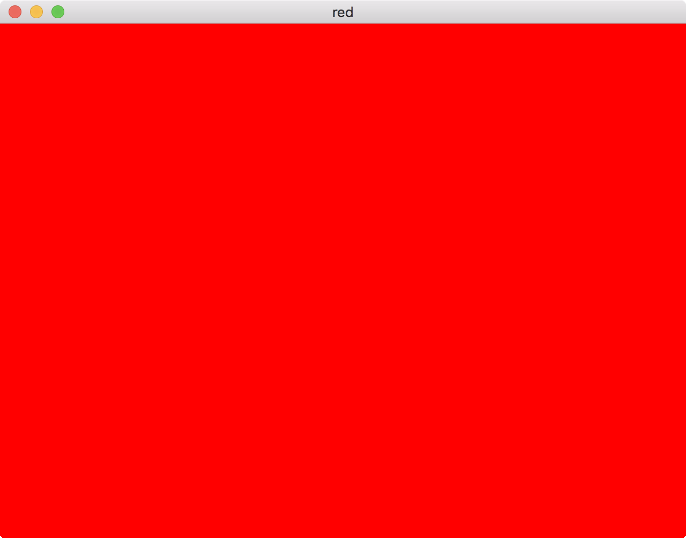

Get started with 

```
git clone --recursive https://github.com/alecjacobson/glred.git
```

Then build with

```
mkdir build
cd build
cmake ../
make
```

Then run with


```
./glred
```

On the terminal, you'll get some version info such as:

```
OpenGL version           4.1.0
Supported OpenGL is      4.1 INTEL-10.36.25
Supported GLSL is        4.10
```

_**and**_ a window should pop up with a red rectangle:



